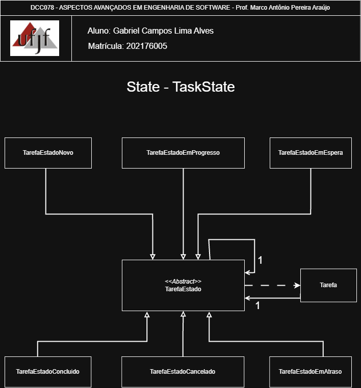

# State — Gerenciamento de Tarefas (State Pattern)

Este projeto demonstra o Padrão Comportamental State aplicado ao ciclo de vida de uma entidade `Tarefa`: operações como iniciar, pausar, concluir, cancelar, atrasar e reabrir são delegadas a objetos-estado (por exemplo `TarefaEstadoNovo`, `TarefaEstadoEmProgresso`), que decidem se a ação é permitida e efetuam as transições, tornando o comportamento por estado encapsulado, testável e extensível.

<p align="center">
	<a href="https://www.ufjf.br/" rel="noopener">
		
	</a>
</p>

<h3 align="center">DCC078-2025.3-A — Aspectos Avançados em Engenharia de Software (UFJF/ICE)</h3>

---

## 📝 Sumário
- [Sobre](#sobre)
- [Diagrama Nível de Projeto](#diagrama)
- [Funcionalidades](#funcionalidades)
- [Tecnologias](#tecnologias)
- [Exemplo de Uso](#exemplo)
- [Como Executar e Testes](#testes)
- [Autor](#autor)

## 🧐 Sobre <a name="sobre"></a>
> **Disciplina:** DCC078 – Aspectos Avançados em Engenharia de Software   </br>
> **Projeto:** Aplicação do Padrão Comportamental State — Gerenciamento de Tarefas   </br>
> **Docente:** Prof. Marco Antônio Pereira Araújo  </br>
> **Data de entrega:** 16/10/2025   </br>
> **Aluno:** [Gabriel Campos Lima Alves](#autor)  </br>

### Padrão State
Implementação do padrão comportamental **State** no contexto de tarefas/atividades.
O **State** é um padrão que permite alterar o comportamento de um objeto quando seu estado interno muda — parece que o objeto mudou de classe.
No projeto demonstramos:
- Diferenciação de comportamentos por estado ao delegar operações para objetos-estado
- Transições de estado encapsuladas em singletons de estado (mesmo estilo do repositório exemplo)
- Facilidade para estender novos estados sem modificar as regras de cliente
- Representação clara da matriz de transição por meio de testes automatizados

## 📐 Diagrama de Classe <a name="diagrama"></a>
O diagrama abaixo representa a arquitetura do projeto, destacando a aplicação do padrão **State** no gerenciamento de tarefas:

<p align="center">
	
</p>

## 🚀 Funcionalidades <a name="funcionalidades"></a>
### Sistema de Gerenciamento de Tarefas
- **Tarefa**: Objeto que delega operações ao seu estado atual
- **TarefaEstado**: Interface que define operações possíveis (iniciar, pausar, concluir, cancelar, atrasar, reabrir)
- **Estados concretos**: `TarefaEstadoNovo`, `TarefaEstadoEmProgresso`, `TarefaEstadoEmEspera`, `TarefaEstadoConcluido`, `TarefaEstadoCancelado`, `TarefaEstadoAtrasado` — implementados como singletons

### Recursos
- ✅ Comportamentos condicionados pelo estado atual da tarefa
- ✅ Transições de estado encapsuladas nos objetos de estado
- ✅ Evita condicionais espalhadas pelo código cliente
- ✅ Testes que validam a matriz de transição de estados
- ✅ Facilidade para adicionar novos estados e regras sem alterar clientes

##  Tecnologias <a name="tecnologias"></a>
- **Java 11+**
- **JUnit 5** - Framework de testes
- **Maven** - Gerenciamento de dependências
- **Git** - Controle de versão

## 📊 Exemplo de Uso <a name="exemplo"></a>
```java
// Criando uma tarefa nova
Tarefa tarefa = new Tarefa();
System.out.println(tarefa.getNomeEstado()); // "Tarefa Nova"

// Iniciando a tarefa
tarefa.iniciar();
System.out.println(tarefa.getNomeEstado()); // "Tarefa Em Progresso"

// Pausando a tarefa
tarefa.pausar();
System.out.println(tarefa.getNomeEstado()); // "Tarefa Em Espera"

// Reabrir uma tarefa concluída
tarefa.iniciar(); // volta para Em Progresso
tarefa.concluir();
System.out.println(tarefa.getNomeEstado()); // "Tarefa Concluida"
tarefa.reabrir();
System.out.println(tarefa.getNomeEstado()); // "Tarefa Em Progresso"

// Exemplo de fluxo completo com atrasos e cancelamentos
Tarefa t2 = new Tarefa();
t2.atrasar(); // Tarefa Atrasada
t2.iniciar(); // volta para Em Progresso
t2.cancelar(); // Tarefa Cancelada

```

## 🧪 Como Executar e Testes <a name="testes"></a>
### Cobertura de Testes
- ✅ **Transições principais**: iniciar/pausar/concluir/cancelar/atrasar/reabrir
- ✅ **Estados isolados**: comportamentos negados quando operação não é permitida
- ✅ **Validação da matriz**: testes que asseguram as transições e estados finais

### Pré-requisitos
- Java 11 ou superior
- Maven 3.6+

### Comandos
```bash
# Compilar o projeto
mvn clean compile

# Executar testes
mvn test

# Executar teste específico
mvn test -Dtest=TarefaTest#deveConcluirEmProgresso

# Empacotar
mvn package
```

## 👨‍💻 Autor <a name="autor"></a>
**Gabriel Campos Lima Alves**  
Matrícula: 202176005  
Email: campos.gabriel@estudante.ufjf.br  
GitHub: [@CamposCodes](https://github.com/CamposCodes)

---

*Projeto de uso acadêmico exclusivo para a disciplina DCC078 - UFJF*
